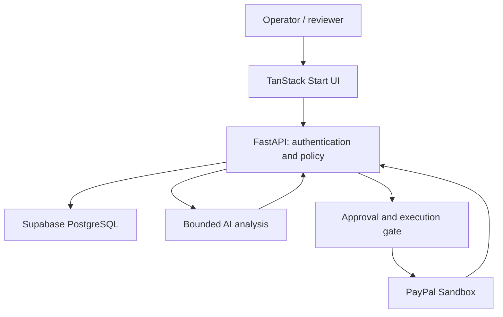
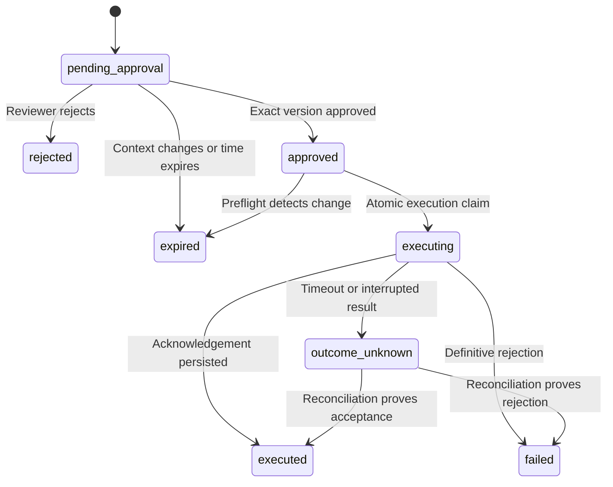

# ChargebackOS for PayPal — execution playbook

**Version 2.0 · 8 October 2026 · Owner: project founder · Technical lead: collaborating developer/agent**

**Purpose:** build a demonstrably working PayPal dispute workbench and a strong engineering portfolio project. This is a specification and operating procedure. Planned behavior below is not implemented merely because it appears here.

**Start here:** read sections 1–5, find the first unfinished task in section 12, and follow the handoff procedure in section 15. Do not rebuild the application from this document's examples.

## Contents

1. [Current state and document authority](#1-current-state-and-document-authority)
2. [Product, user and success](#2-product-user-and-success)
3. [Decisions on the supplied plan](#3-decisions-on-the-supplied-plan)
4. [Source review and competition strategy](#4-source-review-and-competition-strategy)
5. [Architecture and boundaries](#5-architecture-and-boundaries)
6. [PayPal capability proof and integration contract](#6-paypal-capability-proof-and-integration-contract)
7. [Data model and migration contract](#7-data-model-and-migration-contract)
8. [AI, evidence and prioritization](#8-ai-evidence-and-prioritization)
9. [Approval, execution and reconciliation](#9-approval-execution-and-reconciliation)
10. [API and interface specifications](#10-api-and-interface-specifications)
11. [Environments, recovery and deployment](#11-environments-recovery-and-deployment)
12. [Ordered implementation tasks](#12-ordered-implementation-tasks)
13. [Acceptance matrix and measurement](#13-acceptance-matrix-and-measurement)
14. [Schedule, submission and portfolio](#14-schedule-submission-and-portfolio)
15. [Agent/human operating procedure](#15-agenthuman-operating-procedure)
16. [Glossary and source register](#16-glossary-and-source-register)

## 1. Current state and document authority

### What is actually known

| Item | Verified state at this review |
|---|---|
| Repository | `msrishav-28/chargebackos`; pre-hackathon baseline `00e56f5` |
| Recovery work | Draft PR #1, branch `codex/supabase-recovery-plan`, code commit `ee226d8`; not merged when checked |
| Verification | CI run `37638606498`: 59 API tests pass, including PostgreSQL migrations; website typecheck, lint, build and three schema tests pass |
| Offline model | Training completed locally; generated artifact served successfully through `/health/model` |
| Hosted application | Reported broken by owner; actual failing URL/logs not yet supplied; root cause unverified |
| Supabase migration | Compatibility changes prepared; no live records or host settings changed |
| PayPal | No adapter or verified sandbox capability in the current application |
| Current AI | Synthetic tabular model plus optional xAI paragraph ordering; not the analysis workflow proposed below |
| Existing UI | TanStack Start, React, Tailwind, TanStack Query; not a plain static Vite site |
| Existing database | 20 SQLAlchemy application tables; Alembic owns schema; FastAPI owns sessions |
| Access | GitHub available. Render and Supabase integrations declined. Do not request those integrations again; use owner-operated settings/logs or an explicitly authorized alternative |

The test counts are historical verification of a specific commit, not a permanent badge for later code.

### Authority and branches

This playbook supersedes the proposed scope/sequence in `docs/shipping-plan.md` and reconciles the supplied `chargebackos_paypal_ai_hackathon_plan.md`. Existing code remains the authority for what runs today. `AGENTS.md` governs repository work; owner instructions supersede its older choices. Official hackathon rules govern competition questions.

Use the current PR for the recovery foundation. After it is accepted, use short task branches from the latest accepted base and PRs into `main`. The attachment's `paypal-ai-hackathon` branch name is not a requirement; do not create a divergent second implementation. Never force-push or rewrite the pre-hackathon history.

Status vocabulary: **verified**, **implemented but unverified**, **planned**, **blocked**, **cut**. Never use “done” without an artifact and the named acceptance test.

## 2. Product, user and success

**Product promise:** help a small merchant turn a PayPal dispute into a source-linked, reviewed evidence response, with a visible record of what was sent and what PayPal acknowledged.

Primary persona: one merchant operations analyst. Secondary persona: the reviewer who authorizes a response. Initial deployment has one configured sandbox seller, not a public multi-merchant SaaS onboarding system.

Primary scenario: physical goods, item-not-received dispute, USD. Existing INR synthetic evaluation remains a separate mode. Other dispute reasons may be imported and inspected; unsupported response types are routed to review, not force-fitted into the supported scenario.

### The complete vertical slice

1. Sign in and select the sandbox workspace.
2. Sync disputes from the configured seller account.
3. Open a case with its provider ID, amount, currency, deadline, source and last sync time.
4. Inspect transaction context and merchant-supplied fulfillment records separately.
5. Run AI analysis: cited summary, contradictions, unknowns and a proposed response structure.
6. See deterministic evidence requirements and why preparation is allowed or blocked.
7. Create a draft linked to evidence; review its exact text and payload.
8. Reviewer approves a specific immutable version.
9. Reviewer sends that approved evidence to **PayPal Sandbox**.
10. View the acknowledged provider result, refreshed case and audit timeline.
11. Repeat with missing evidence: preparation/submission is blocked and the reason is useful.

**Release target includes the sandbox write.** Export is also useful but does not replace this target. An account/API blocker is reported as a blocker; a fixture is not promoted to a real integration to make the milestone appear complete.

### Outcomes we will measure

Targets below are our engineering goals, not achieved results or competition guarantees:

- Five repeatable narrative cases; one successful real sandbox evidence submission.
- No unauthorized submissions, duplicate sends in the concurrency test, or bypass of missing-evidence policy.
- Every accepted AI factual claim has a resolvable source; numeric/date identifiers are checked against source fields.
- Zero unsupported factual claims in the manually reviewed release evaluation set.
- Warm list/detail API p95 under 1 second for 50 requests on the demo dataset; measure network/client timing separately.
- AI analysis p95 under 20 seconds over at least 20 runs; requests terminate by 30 seconds and preserve existing work on failure.
- Record preparation time and edits for five cases with and without assistance. Report sample size and method; a convenience sample is not causal proof of ROI.

### What makes this portfolio-worthy

The strongest story is the engineering behind trust: a real integration, careful state transitions, transaction boundaries, difficult retry behavior, honest AI evaluation, accessible product design, and a reproducible deployment. Show those decisions and tests. Avoid claiming this is the first dispute product or a proven way to recover more money.

## 3. Decisions on the supplied plan

| Supplied proposal | Decision | Concrete replacement / reason |
|---|---|---|
| Preserve ChargebackOS and dispute domain | Keep | No rename, no recovery-product pivot |
| Supabase as the only application database | Keep | Move all application records and sessions; keep a source backup until accepted |
| Add a Supabase client and `supabase/migrations` | Veto | Keep SQLAlchemy/psycopg and Alembic. Two schema authorities or two persistence paths would create drift |
| Replace tables with `profiles` and `disputes` | Veto | Extend `operator_users` and `dispute_cases`; migrate explicitly without duplicating the existing book |
| Rename API routes to `/api/disputes` | Veto | Preserve `/api/v1/*` and the existing health routes; add compatible endpoints |
| Grow `main.py` or refactor everything first | Modify | Extract routers incrementally under contract tests; no wholesale backend rewrite |
| PayPal “sandbox or demo” milestone passes either way | Veto | Fixtures support development; real sandbox reads and evidence submission are release gates |
| “Execute one approved provider action” | Specify | `provide-evidence` only, using an eligible sandbox case; no refund, accept-claim, offer or customer-message tools |
| Numeric LLM confidence | Veto | Show evidence coverage, source freshness, unknowns and reviewer status. Do not invent calibrated probabilities |
| AI decides priority/missing requirements | Modify | Code computes deadlines, priority and required-field completeness; AI explains context and identifies candidate contradictions/gaps |
| “Agent” framework / PayPal toolkit required | Veto as a dependency | Direct typed REST adapter plus one bounded AI workflow. Toolkits remain development aids, not assumed capability guarantees |
| Approval states end in executed/failed | Expand | Add stale/expired and unknown outcome; distinguish provider acceptance from case resolution |
| Append-only audit | Keep, make enforceable | Runtime cannot update/delete audit events; corrections append; reset never erases sandbox history |
| Four Render services | Cut | Keep existing frontend host and one Render API. No dedicated worker or migration service in this release |
| Render frontend or another host | Resolve | Vercel frontend shape stays; Render is the API deployment target. Do not migrate both hosts while diagnosing an outage |
| Approvals and Activity pages | Keep | Add after case-level workflow works; they are views of the same records, not new parallel systems |
| Ten-minute setup promise | Replace with measured target | Measure clean setup after prerequisites exist; do not include account provisioning or network downloads in an unqualified guarantee |
| Demo reset | Restrict | Isolated fixture data only; sandbox source records, approvals and audit history cannot be reset through public UI |
| Failed-payment recovery later | Cut from this roadmap | It dilutes the dispute story and conflicts with the retained product boundary |
| Strong ML/LLM claims | Narrow | Synthetic benchmark stays labeled; paragraph ordering alone is insufficient for our desired AI experience |
| Claim winning is certain | Reject | Control delivery and evidence. Judges control awards |

## 4. Source review and competition strategy

### Review coverage

Read completely: the supplied Overview, Resources and Rules pages, including Rules sections 1–15, prize tables, submission/access provisions and footer references; and every section of the attached Markdown plan. Reading a linked page title is not treated as reading its linked content. Additional relevant PayPal API, sponsor and hosting documents are in section 16.

The Resources page is a directory, not an instruction to integrate every sponsor. Linked webinars were identified, not watched; their registration pages are not evidence of API capability. The linked agent-tools reference could not be retrieved; no implementation claim depends on it.

### Competition facts [S1, S2]

Submission closes 12 November 2026 at 12:00 PST (13 November, 01:30 IST). Judging ends 15 December. An eligible entry combines PayPal sandbox and AI; an older project needs significant in-period advancement. Deliver a functional build, public licensed source, English description/instructions, tool attribution and a public YouTube demonstration under three minutes. Maintain free judge access. The five equally weighted criteria are technical implementation, design, impact, innovation and presentation. Owner must check eligibility, ownership, third-party rights, conflicts and incorporated terms personally; this document does not certify them. Prize stacking is limited. Read the official terms before entering and retain the submission receipt.

### Our evidence for each criterion

| Criterion | Product proof we will show | Artifact |
|---|---|---|
| Implementation | Actual provider response plus approval and reconciliation | Redacted receipt, contract tests, sequence diagram |
| Design | One coherent case workflow with useful blocked/error states | Hosted flow and accessibility notes |
| Impact | A defined operator job and observed preparation effort | Five-case timing/edit study and limitations |
| Innovation | Evidence/approval versions invalidate stale actions; unknown outcomes cannot double-send | Failure demonstration and design note |
| Presentation | One success, one refusal, direct source traceability | Rehearsed 2:45 video |

These are our strategies, not extra sponsor requirements.

### Resource decisions [S3–S6]

- **Render:** already fits the product. Its sponsor page advertises $50 credits; the owner checks eligibility and billing before redemption/use. We will document deployments, health checks and recovery. Render Workflows is described by the sponsor but is not necessary for our bounded release.
- **APIMatic:** optional developer assistance. Record actual use if adopted; do not claim an integration or prize eligibility just for reading its page.
- **AG Grid / Bryntum:** defer replacing the working table. Revisit only after the core acceptance flow is green and a specific missing interaction justifies the change.
- **Postman:** a portable API collection is a useful optional reviewer artifact; tests remain in the repository.
- **Astropods, Channel3, Elastic, KERNEL, Zapier:** no role in the locked slice. Do not add dependencies for sponsor logos.
- **PayPal AI Toolkit/MCP:** optional development resources. They do not remove our server permissions, validation or approval requirements.

Focus the pitch on PayPal + AI and a well-built business tool. Do not force a commerce-agent category narrative onto dispute operations. The overview contains different aggregate cash/total-prize figures; the plan does not rely on a headline sum. Verify any prize claim against the current official rules.

## 5. Architecture and boundaries



| Boundary | Owner | Allowed responsibility |
|---|---|---|
| Browser | React + TanStack Query | Render state; send authenticated user intents; no provider/database credentials |
| HTTP | FastAPI routers | Validate inputs, authenticate, authorize, return typed results |
| Domain | Policy/evidence/approval modules | Pure decisions and explicit state transitions |
| Services | Application workflows | Transactions, version checks, orchestrated reads/writes, audit |
| Persistence | SQLAlchemy repositories where useful | Scoped queries and locks; never a parallel Supabase REST database client |
| Provider | `integrations/paypal.py` | OAuth and only allowlisted sandbox operations |
| AI | `integrations/ai.py` | One provider; bounded structured generation; no external-action credential access |

Keep existing `core/config.py`, `db.py`, `models.py`, `services/*` and `domain/*`. Add `routes/`, `schemas/`, `integrations/` and narrowly scoped repository modules when tasks need them. Do not copy the attachment's proposed tree wholesale. Keep migrations under `api/alembic/versions`.

### Non-negotiable invariants

- Only FastAPI may change product records; UI hiding is not authorization.
- Every sandbox send binds the exact approved payload, evidence version, policy version, source snapshot and seller.
- Missing provider capability, stale data or missing required evidence blocks sending.
- Unknown data is nullable with a reason; zero/false is not a substitute for unknown.
- Browser roles have no direct access to operational tables. RLS does not replace backend permission checks.
- Synthetic cases, provider cases and their metrics remain distinguishable everywhere, including exports.
- All calls to PayPal in this release use the fixed sandbox host. Application startup rejects a production host.
- A provider acknowledgement means evidence was accepted for processing, not that a dispute was won.
- No live payment, refund, customer-contact or dispute-settlement operation exists in the application's action allowlist.

## 6. PayPal capability proof and integration contract

### Critical feasibility finding [S7–S10]

PayPal documents list/detail and evidence submission. Available actions depend on the current dispute and its returned links; seller evidence requires an eligible seller-response state. The documented sandbox creation flow has extra buyer consent/permission steps, including a creation scope that may need account-manager enablement. A client ID and secret alone do not prove that we can create repeatable disputes. Verify the chosen account immediately.

**Selected external write:** `POST /v1/customer/disputes/{id}/provide-evidence`. Use the current provider schema and verify multipart construction against a real sandbox fixture. Never infer the schema from a UI mockup. Notes/documents and evidence type must satisfy the provider request. The application additionally enforces its own evidence policy.

### Capability proof, before large implementation

Owner creates or identifies a sandbox business seller and personal buyer in the PayPal Developer Dashboard, creates a sandbox REST app and enables its Disputes feature. Credentials stay in local/hosting secrets.

Developer then:

1. Obtain an OAuth token server-side; retain only scope names, expiry and status in the redacted capability report.
2. List seller disputes. Record whether the account has access; an empty list is not a successful complete fixture.
3. Obtain one legitimate sandbox test dispute. Use an existing controlled test case, the available buyer-side sandbox UI flow, or the documented sandbox setup with the required permission. These are fixture-creation procedures, not product features.
4. Retrieve that case and capture its ID, seller identity, transaction context, response status and allowed action relations in redacted form.
5. Prepare a disposable evidence-response fixture. A sandbox-only status helper may assist setup when PayPal exposes the relevant capability; do not add it as a public product action.
6. Send a minimal truthful test evidence payload to the eligible fixture; retain the provider acknowledgement and follow-up read.
7. Recreate or obtain a second fixture to prove rehearsal is repeatable.
8. Document date, endpoint, status, available capability and observed limitation in `docs/paypal-capability-report.md`.

Two-hour initial investigation timebox. Missing permission gets a precise owner-facing blocker and a draft support question; do not send it without the owner's authorization. After 24 hours without a usable fixture, escalate the milestone and continue independent schema/UI work. No fake green status. A missed feasibility gate may change the delivery forecast; it must not change the meaning of “PayPal integrated.”

### Adapter contract (planned)

| Method | Network behavior | Product use |
|---|---|---|
| `get_access_token()` | OAuth against fixed sandbox endpoint; cache until before expiry | Backend authentication |
| `list_disputes(cursor)` | Bounded paginated read | Explicit sync |
| `get_dispute(id)` | Read by validated identifier | Import, pre-send refresh, reconciliation |
| `provide_evidence(id, payload)` | One approved POST attempt | Sandbox evidence submission |

Transaction context comes first from `disputed_transactions` in the detail response. Preserve seller and buyer transaction IDs separately. Do not add Transaction Search access as an unproven critical dependency; add enrichment only after a proven account capability and a clear missing field.

Initial network limits: 5-second connect timeout, 20-second total provider request deadline; at most two retries for safe GETs on transient errors with backoff/jitter; respect rate-limit timing within the total deadline. A GET may refresh an expired token once. POSTs have **no blind retry**. Persist safe diagnostic fields such as status, debug ID and attempt ID; never OAuth tokens, secrets or full sensitive responses in application logs.

Validate HATEOAS links rather than following arbitrary URLs: scheme HTTPS, exact sandbox host, expected method/path, same dispute ID and allowed relation. Reject redirects to any other host. The configured seller is server-owned; a browser cannot select another seller credential.

## 7. Data model and migration contract

### Extend the current model; do not replace it

`operator_users`, `operator_sessions`, `merchants`, `transactions`, `dispute_cases`, `evidence_packages`, `evidence_items`, `policy_decisions`, `representment_drafts`, `audit_events` and evaluation tables already exist. Keep their IDs and relationships. A new `profiles` table is unnecessary.

Before adding a model, freeze `0001_initial` into explicit historical operations. It currently imports today's ORM metadata; leaving that behavior would make fresh installations create future tables before their own revisions. Verify upgrade both from empty PostgreSQL and from revision `0002_backend_only_access` with representative data.

### Planned schema changes

Types below are contracts to implement with named constraints and indexes, not SQL to execute on an unknown hosted database.

| Entity | Required additions / behavior |
|---|---|
| `dispute_cases` | `source_kind` enum-like string: `synthetic` or `paypal_sandbox`; nullable provider status/stage/deadline; `record_version` integer; preserve local state separately; unique provider key scoped to source + merchant + external ID |
| Existing case fields | Synthetic `split` and `contest_cost` may be null on sandbox cases; customer/transaction associations may be null when unavailable. Validate by source, never manufacture missing records to satisfy a foreign key |
| `transactions` / `customers` | Unknown non-provider history/auth/device fields become nullable where needed; retain constraints for synthetic fixtures in application validation. Financial amount remains exact Decimal with explicit currency |
| `provider_snapshots` (new) | UUID, case/merchant FK, provider, provider ID, provider update time, fetched time, redacted/minimized source JSON, full SHA-256 digest, imported-by operator; immutable snapshot versions |
| `ai_recommendations` (new) | UUID, case FK, snapshot/evidence digest, provider/model identifier, prompt/schema version, validated structured output, state, elapsed time, token usage when returned, created-by/time |
| `approval_requests` (new) | UUID, case/merchant FK, draft FK, action type, environment, payload JSON, payload SHA-256, source/evidence/policy versions, requester, reviewer, status, expiry, timestamps, rejection reason, integer row version |
| `provider_attempts` (new) | UUID, approval FK, attempt number, payload digest, state, start/end time, provider status/debug ID, safe response/receipt, error code and reconciliation outcome; unique approval + attempt number |
| `audit_events` | Add explicit merchant/context, approval/attempt correlation where relevant; append-only runtime privileges; server timestamp; no credentials or arbitrary full request bodies |
| `representment_drafts` | Persist new versions instead of editing an approved row. Link approval to an immutable version. Keep text, citation map, evidence hash and creation mode (`ai_assisted`, `template`, `human_edited`) |
| `evidence_packages` / policy hashes | Widen old 16-character hash columns or add versioned full SHA-256 columns. Backfill before binding approvals; do not silently reinterpret old short hashes |

Evidence records distinguish `paypal_sandbox`, `merchant_fixture`, `merchant_entered`, and `synthetic_generator` sources. A merchant assertion is not verified delivery just because it has a citation. Record what kind of source supports each claim.

The initial supported provider amount is USD; existing synthetic INR remains supported. Keep totals grouped by currency. Preserve original strings and parse with Decimal; do not use binary floats in new monetary calculations. Unknown/unsupported currencies are inspectable but cannot be sent through the supported response workflow. Never use INR (the currency) as a shorthand label for “item not received.”

### Access and append-only records

A dedicated project is preferred. First recovery may use the schema owner as documented in PR #1. Before the public submission release, provision a dedicated backend runtime role for application tables and a separate migration owner credential. The runtime role receives only necessary SELECT/INSERT/UPDATE rights; audit UPDATE/DELETE and schema modification are absent. Owner/service policies must be explicit for RLS-enabled tables; a restricted role will not work merely by changing the connection username.

Test permissions as the actual role, not as `postgres`. Add an audit UPDATE/DELETE rejection trigger as defense in depth. Replace cascade paths that could erase audit records; archive cases instead of deleting them. Do not call the result tamper-proof: privileged database administration remains outside this threat boundary.

Every new table: RLS enabled, browser grants revoked, runtime policy/grants tested, relevant indexes and foreign keys present. No blanket public read policy. No service-role browser client.

### Reset and migration safety

The current admin reset can erase case history. Disable it for the shared sandbox environment before adding immutable audit protections. Fixture resets run only against a dedicated local/test database or a separately isolated fixture deployment, after an explicit target check. Public judges do not receive reset/admin power. Destructive source deletion or shared reset is outside these implementation tasks.

## 8. AI, evidence and prioritization

### Responsibilities

| Computation | Owner | Why |
|---|---|---|
| Deadline arithmetic, currency math, mandatory evidence | Deterministic Python | Reproducible and testable |
| Provider action availability, permissions, approval validity | Deterministic Python | Never delegated to generated text |
| Cited case summary and candidate contradictions | LLM | Useful language synthesis across records |
| Response outline and draft wording | LLM with validation + reviewer | Reduce preparation effort without granting authority |
| Synthetic category/win estimates | Existing offline model only | Existing evaluation scope; not validated for sandbox/real merchant outcomes |

Keep xAI as the initial language provider because the repository already has that interface. Put the selected model in `AI_MODEL`, not a hardcoded string. During T03, verify an account-accessible structured-output model and pin its exact identifier in the environment and capability report. No provider-selection debate after that gate; switching requires a recorded failure/cost reason. The legacy `grok-4.5` string is not assumed available. Schema-conforming output still requires factual validation. [S14]

No autonomous browsing, arbitrary tools or free-running agent loop. A bounded service loads authorized context, calls the model, validates, persists and returns. The six “agent tools” in the attachment become ordinary tested service functions initially. None exposes PayPal write credentials.

### Deterministic queue priority, version `priority-v1`

Use UTC now and provider deadline. Label expired cases `overdue / review required`; never silently extend the provider deadline. Sort unresolved cases into these tiers:

1. Deadline passed or within 24 hours: critical.
2. Deadline missing, or within 72 hours: high; missing date explicitly says “deadline unknown.”
3. Within 7 days: medium.
4. More than 7 days: low.

Within a tier, sort earliest known deadline first, then incomplete required evidence first, then case ID for stable ordering. Do not compare monetary urgency across currencies. Provider-resolved cases are outside the active queue. The LLM may explain the priority but cannot change it. Boundary tests cover exactly 24/72/168 hours, null dates, timezone conversion and resolved cases.

### Evidence requirements

The first local policy supports physical-goods non-receipt: provider transaction/dispute context, merchant fulfillment source with tracking or delivery support, matching transaction reference, and no unresolved contradiction about shipment/refund. This is our conservative product policy, not a promise of PayPal legal sufficiency.

PayPal-requested evidence and available response capability are additional constraints, not substitutes for our policy. Other reasons route to reviewer-only inspection until a versioned mapping is implemented and tested. Do not reuse synthetic mandatory fields (device consistency, 3DS, customer history) as if PayPal supplied them.

Evidence completeness is `present_required / required_total` for the selected policy. Show both counts and named missing items. “Present” means a nonempty source record exists; it does not prove the underlying event happened. Conflicts have their own flag and block auto-preparation. Unknown policy mappings show “unsupported,” not 100% complete.

### Planned AI output contract

```json
{
  "schema_version": "analysis-v1",
  "summary_claims": [
    {"text": "The dispute concerns an item reported not received.",
     "source_record_ids": ["snapshot-example"],
     "source_paths": ["reason"]}
  ],
  "candidate_contradictions": [],
  "unknowns": ["Carrier delivery confirmation is unavailable."],
  "suggested_next_steps": ["Review the merchant fulfillment record."],
  "draft_sections": [],
  "limitations": ["No conclusion about the buyer's intent is supported."]
}
```

Example IDs above are illustrative, never seed provider IDs. The server adds the stored context hash, priority, policy outcome and generation metadata. The model cannot set `approved`, `submitted`, provider status or monetary outcomes. Pydantic rejects extra fields and bounds list/text sizes.

Validation procedure:

1. Reject malformed, oversized, incomplete or truncated output; preserve the last valid draft.
2. Resolve every cited ID within the authorized case and exact supplied snapshot. A citation from another case fails.
3. Verify quoted source fragments and structured amounts/dates/IDs exactly; the model cannot rewrite these facts.
4. Require reviewer inspection for paraphrase entailment and contradictions. Citation existence alone does not establish truth.
5. Mark candidate gaps separately from deterministic missing requirements. AI cannot clear a missing-evidence gate.
6. Save accepted output and its versions. Redact sensitive content from errors.
7. On timeout, show a clear failed-analysis state and allow the grounded template path, labeled as such. No hidden fixture or template masquerades as an AI success.

Initial limits: at most 20 source records, 40,000 input characters and 2,000 output tokens per call; overflow produces an explicit context-too-large state, not silent evidence loss. One schema-repair attempt at most within the 30-second overall deadline. Add per-user/case throttling and a configurable daily call ceiling before exposing the judge demo.

### AI evaluation

Build 30 authored, labeled evaluation cases: 10 supported complete cases, 8 missing-evidence cases, 5 contradictory records, 4 evidence-instruction attacks and 3 unknown/unsupported cases. Keep expected claims/gaps separate from model input. Freeze the set before prompt tuning; maintain a smaller separate development set.

For each run record provider/model, prompt/schema version, context digest, latency, token usage, schema validity, resolvable citations, supported claims, missed gaps, unnecessary claims and reviewer edits. Two human passes are preferred; with one reviewer disclose that limitation. A schema test or second LLM judge is not proof of truth.

Release thresholds: 100% resolvable citations and zero unsupported claims in accepted output on this finite suite; all missing-required-evidence and instruction-attack cases must preserve the server gate. Report the numerator/denominator, not a general accuracy claim. Compare with the deterministic template for drafting effort and correctness. Keep the existing four-strategy synthetic benchmark as a separate evaluation artifact.

## 9. Approval, execution and reconciliation

Use three separate notions: local case state, approval state and PayPal provider state. Never set `won_simulated` because a sandbox request returned 200. Existing synthetic lifecycle paths remain source-specific.



A draft is the proposal; there is no need for a redundant `proposed` approval row. Initial approval expiry is 30 minutes or the response deadline, whichever is sooner. Expired/rejected/failed requests are terminal; create a new request after correction. A new request may not bypass an unresolved unknown outcome for the same case/action.

### Role matrix

| Action | Viewer | Analyst | Reviewer | Admin |
|---|---|---|---|---|
| Read authorized cases | Yes | Yes | Yes | Yes |
| Sync configured seller | No | Yes | Yes | Yes |
| Analyze, create evidence/draft, request approval | No | Yes | Yes | Yes |
| Approve/reject another operator's request | No | No | Yes | Yes |
| Send approved sandbox evidence | No | No | Yes | Yes |
| Reconcile ambiguous attempt | No | No | Yes | Yes |
| Shared sandbox reset | No | No | No | No |
| Local isolated fixture reset | No | No | No | Explicit test-only control |

Author cannot approve their own requested version. Seed separate analyst and reviewer test accounts. Existing users are staff for the single configured sandbox seller; enforce that binding in server queries. Do not market this as multi-tenant isolation. Add two seller contexts in tests to verify cross-context identifiers cannot reach a different credential or record.

### Request, approval, execution

1. **Request:** authenticate analyst; load current policy/evidence/draft; validate action; create a normalized immutable payload and SHA-256; save `pending_approval` with context digests and expiry.
2. **Approve:** authenticate a different reviewer; lock the approval; require expected row version, pending state and matching context; save reviewer/time. Approval itself does not send anything.
3. **Send:** reviewer explicitly invokes execute with an `Idempotency-Key`. Re-fetch provider detail before claiming execution; reject stale deadline, absent capability, seller mismatch or changed material source data. Volatile fields such as fetch timestamp do not alone invalidate evidence; hash the defined relevant fields.
4. **Claim:** in one short transaction, compare versions and atomically change approved → executing; insert an attempt and audit intent. A unique active execution constraint prevents another request from claiming the same approval/case response version. Commit **before** network I/O.
5. **Call:** send the exact stored payload once. Do not hold row locks through the external request. No LLM output is evaluated as a command or URL.
6. **Persist:** save acknowledgement or definitive rejection and matching audit outcome in one transaction. A success response lost before commit leaves a recoverable unknown state, never an automatic resend.
7. **Read back:** refresh provider details and display acknowledgement plus observed provider state. Failed read-back does not erase a persisted valid acknowledgement; show “refresh pending.”

The endpoint uses the persisted attempt as the source of truth. Duplicate keys with the same payload return the existing operation; the same key with a different payload returns 409. Key lookup is scoped to operator/merchant/action and stores request digest, not just a global arbitrary string.

### Unknown outcome is a real state

A POST timeout, dropped connection after dispatch, process termination, or ambiguous provider 5xx is `outcome_unknown`. A restart marks abandoned executing attempts unknown after a bounded lease; it never resends them. Reconciliation performs safe reads and compares observable evidence/receipt data. A reviewer resolves only with recorded evidence. When acceptance cannot be proved or disproved, retain unknown and block repeat submission. Do not claim distributed exactly-once delivery.

The initial implementation has no always-running worker. Execution is bounded in a request; persisted attempts survive crashes. Explicit reconcile on the UI/admin startup inspection handles interrupted attempts. Add a worker only under a separate measured requirement after the submission.

Audit corrections append a new event. Include case, actor, approval, attempt, before/after state, context version, safe error and timestamp. Log an action being blocked separately from changing the case state. The current invariant “no write” on invalid transitions means no unauthorized business-state mutation; recording a blocked audit event is intentional.

## 10. API and interface specifications

### Preserve working contracts

Keep `/health/live`, `/health/ready`, `/health/model`, `/api/v1/auth/*`, existing case/queue/policy/evaluation routes and their consumers. Do not introduce `/api/health/supabase` as a replacement. Add fields compatibly where possible; update FastAPI response models and Zod schemas in the same task when a contract must change.

Source-aware case responses need explicit optional fields: a sandbox case may lack a synthetic prediction, customer history, simulation split or cost estimate. Test that the UI renders unknowns rather than failing its schema or generating values.

### Planned endpoints

| Method and path | Role / inputs | Result and failure contract |
|---|---|---|
| `GET /api/v1/integrations/status` | Signed-in staff | Configured mode, cached last-check status/time, safe error; no keys and no paid network calls per poll |
| `POST /api/v1/integrations/paypal/sync` | Analyst+; no arbitrary seller or URL | Bounded page sync result with imported/updated/skipped counts and continuation cursor; repeat safe |
| `POST /api/v1/disputes/{id}/analyze` | Analyst+; expected case version | Persisted analysis or typed 409/422/502/504 error; source unchanged |
| `POST /api/v1/disputes/{id}/evidence` | Analyst+; typed merchant source record | New evidence version and invalidated old approvals; not an arbitrary file/URL fetch |
| `POST /api/v1/disputes/{id}/drafts` | Analyst+; analysis/evidence versions | New version; missing requirements return 409 |
| `POST /api/v1/disputes/{id}/approvals` | Analyst+; draft ID + case version | 201 immutable pending approval; action type restricted server-side |
| `GET /api/v1/approvals` | Staff; scoped filters/page | Paginated requests |
| `POST /api/v1/approvals/{id}/approve` | Reviewer+; expected version | Approved version; self-approval/stale forbidden |
| `POST /api/v1/approvals/{id}/reject` | Reviewer+; expected version + reason | Rejected; no provider call |
| `POST /api/v1/approvals/{id}/execute` | Reviewer+; idempotency key | 200 operation result for terminal known outcome; 202 when reconciliation pending; a provider failure is never success merely because HTTP returned 200 |
| `POST /api/v1/approvals/{id}/reconcile` | Reviewer+ | Read-only provider checks; updated operation or still unknown |
| `GET /api/v1/audit-events` | Staff; scoped filters/page | Append-only history view |
| `GET /api/v1/disputes/{id}/export` | Staff | JSON packet + printable HTML view; export remains marked draft/approved/acknowledged correctly |

Global conventions: 401 unauthenticated; 403 role denied; 404 absent/out-of-scope resource; 409 state/version/idempotency conflict; 422 invalid request; 429 local throttling; 502 upstream/schema failure; 503 unavailable configuration/dependency; 504 deadline exceeded. Mutation errors include a safe code, human-readable message, request ID and an operation ID when one exists. Never blindly retry a frontend mutation after timeout.

Initial page size 50, maximum 100; stable sort includes ID. All timestamps are ISO 8601 UTC over the API. Display timezone explicitly in the interface. New money objects use `{ "value": "29.99", "currency": "USD" }`; never format all cases with `formatINR`.

### Screen contract

Keep Column tokens in `DESIGN.md`. New routes `/approvals` and `/activity` extend the existing navigation; Overview, Disputes, Policies, Evaluation, About and Login remain.

| Screen | Must show | Primary action | Acceptance |
|---|---|---|---|
| Overview | Source mode, last sync, open cases, due soon, missing evidence; amounts grouped by currency | Open next case / explicit sync | No invented recovered-money KPI |
| Queue | ID, reason, currency/amount, deadline, local/provider status, evidence, priority | Open case | Search/filter/pagination survive navigation |
| Case | Header; source-linked evidence; AI analysis; response and approval; timeline | Contextual next step | One dominant action, with reason when blocked |
| Approvals | Requester, case, exact payload preview, expiry, reviewer, state | Approve or reject | Self-approval disabled and denied by API |
| Activity | Time, actor, event, case, request/attempt reference, source mode | Inspect event | Stable order and filters; no editable history |
| Evaluation | AI evaluation and synthetic model tabs with explicit labels | Inspect failures | Model limitations visible; no mixing provider data into simulation scores |
| Policies | Current rules, versions, required evidence | Read | No arbitrary threshold edits for judges |
| About | Product scope, tested capabilities, demo walkthrough, limitations | Start walkthrough | No stale Razorpay wording or unsupported production claim |
| Login | Valid staff access and useful setup/wake/error states | Sign in | Never exposes secrets; session-expiry recovery preserves saved records |

Case layout: top header, evidence left and response right on wide screens, timeline below; single stacked column on narrow screens. Citation click focuses the referenced source. Approval dialog shows the exact text/payload, seller, sandbox label, evidence version and consequence. Separate “Approve” and “Send approved evidence to PayPal Sandbox” buttons. Never label sending as winning.

Required states: loading, empty queue, no source record, missing evidence, stale approval, expired session, provider disconnected, database unavailable, AI timeout, definitive provider rejection and unknown outcome. Test at 390px and 1440px. Status is expressed in text as well as color, focus is visible, dialogs trap/restore focus, form errors are associated with fields and all core actions work by keyboard. Target WCAG AA contrast; measure it rather than saying “accessible” based only on appearance.

## 11. Environments, recovery and deployment

### Environment contract

Do not rename existing settings gratuitously. This table distinguishes settings that exist now from those to implement. Only public API origin may be exposed through `VITE_`.

| Name | Status | Required where | Meaning |
|---|---|---|---|
| `DATABASE_URL` | Existing | API | Runtime PostgreSQL connection; Supabase session pooler initially |
| `DATABASE_URL_DIRECT` | Existing | Migration command | Direct/session connection with migration-owner credentials |
| `AUTH_SECRET` | Existing | API | Random secret of at least 32 characters; preserve across data transfer to retain sessions |
| `DEMO_PASSWORD` | Existing | Explicit staff seed only | Unique non-placeholder seed password; not a public admin credential |
| `VITE_API_URL` | Existing | Frontend build | Actual HTTPS API origin; rebuild frontend after changing |
| `WEB_ORIGIN` | Existing | API | Exact frontend origin without path/trailing slash |
| `API_CORS_ORIGINS` | Existing | API/local development | Explicit additional origins |
| `XAI_API_KEY` | Existing | API | Server-only language-provider key |
| `AI_MODEL` | Planned | AI-enabled API | Verified pinned model identifier |
| `APP_ENV` | Planned | API/scripts | `local`, `test`, `sandbox`; no production-provider mode in this release |
| `PAYPAL_MODE` | Planned | API | `fixture` or `sandbox`; absent/invalid values fail validation |
| `PAYPAL_CLIENT_ID`, `PAYPAL_CLIENT_SECRET` | Planned | Sandbox API | Seller app credentials |
| `PAYPAL_MERCHANT_ID` | Planned | Sandbox API | Expected seller binding |
| `DEMO_RESET_ENABLED` | Planned | Isolated fixtures only | False on shared sandbox deployment |
| `AI_DAILY_CALL_LIMIT` | Planned | Public demo API | Owner-approved cost ceiling enforced atomically |

Do not add `SUPABASE_SERVICE_ROLE_KEY`, browser database access, arbitrary `PAYPAL_BASE_URL`, or a broad `DEMO_MODE` switch that silently changes provider behavior. Database passwords and API keys are secret-manager/environment inputs, never form fields in the operator console.

### Local boot procedure (current commands)

Prerequisites: Git, Node 24, Python 3.11 or compatible installed version, and an explicitly selected development PostgreSQL database. The existing Compose file is optional; do not install Docker just for this task when a suitable database exists.

From the cloned repository root, on bash:

```sh
node --version
python --version
python -m venv .venv
.venv/bin/python -m pip install -r api/requirements.txt
npm ci
```

Copy `.env.example` to an ignored `.env` only when `.env` does not already exist. Fill the required values in a trusted editor. Never overwrite an existing environment file. Confirm the target is a development database before initializing. In Windows, use the equivalent `.venv\Scripts\python.exe` executable; do not paste bash path syntax into PowerShell.

First terminal, from `api/`, **development target only**:

```sh
../.venv/bin/python -m alembic upgrade head
../.venv/bin/python -m app.train
../.venv/bin/python -m app.seed
../.venv/bin/python -m uvicorn app.main:app --host 127.0.0.1 --port 8000
```

Second terminal, repository root:

```sh
npm run dev
```

Open `http://localhost:8080`; sign in with the seeded analyst and the locally configured demo password. For hosted data preservation, do not run these initialization commands against the source or restored target. Use the migration procedure in `docs/hosting.md`.

### Current outage diagnosis

Collect actual web/API URLs, deployed SHA, first failed browser request, and redacted Render build/start log. Never ask the owner to paste secrets.

| Symptom | Inspect first | Concrete next check |
|---|---|---|
| API never starts | Build/start log, rootDir, bind port | Compare with `render.yaml`; locate first exception, not last wrapper error |
| Live health fails | Service state/startup | Confirm correct origin and whether instance is waking |
| Ready health fails | DB host, port, TLS, credentials, Alembic | Verify connection from host and revision without printing URI |
| Model health fails | Build training and artifact packaging | Run/import trained artifact from deployed filesystem |
| Browser fails but API health works | `VITE_API_URL`, CORS, HTTPS | Inspect request URL and preflight; rebuild after changing Vite settings |
| Login 503 | Auth configuration | Check placeholder/length validation for secret |
| Login 401 | User in the connected DB, password | Confirm staff seed exists; changing `DEMO_PASSWORD` does not update existing hashes |
| Empty overview | Seed/manifest status | Inspect counts and completed batch, do not reset to hide an initialization issue |

### Database cutover

Use the preserved-data path by default: inventory and back up source; rehearse restore into a dedicated target; migrate and verify schema/access; pause source writes for final copy; reconcile counts and key relationships; switch both connections; redeploy; verify roles, case/evidence/draft links, audit and restart persistence. Source stays retained until acceptance. Never restore provider-owned database roles or overwrite Supabase-managed schemas. Session pooler configuration and TLS follow [S11].

A cutover rollback before target writes can return to the unchanged source. After any target write, stop writes and reconcile those changes before reverting; pointing back to an old database would lose accepted work. Prefer fixing forward for additive schema changes. Application rollback does not imply database downgrade.

### Release deployment

The current Blueprint uses deploy-on-commit. T21 changes the intended API trigger to `checksPass` and verifies the actual service setting, so a failing CI commit is not automatically published. This requires the service's connected Git provider and checks on the linked branch; a bare public-repository URL does not prove automatic deployment is configured. [S12, S13]

Target sequence: PR checks → review/merge → main checks → database-free model/build → additive migration → API startup/health → compatible frontend promotion → hosted smoke test → release record. The existing Vercel frontend deployment must be checked separately; Render settings do not control it. Keep API changes backward-compatible across the deploy window. Do not publish a frontend requiring a backend version not yet healthy.

For the current free-service setup, migration stays before uvicorn in the start command; seed is a separate one-time operation. A paid pre-deploy phase is available only after the owner approves that service configuration. No automatic spending or creation of four services.

Before release, record deployed SHAs, schema version, model/prompt version, health responses, a successful and blocked browser flow, and backup/restore evidence. Provider/AI diagnostic status is cached; load balancer health never spends tokens or sends a sandbox action. Public health reveals no credentials.

Free-service cold starts are a demo risk to measure. Warm up before the recording, document the observed wake behavior, and ask the owner about a bounded hosting budget only after presenting the actual cost and benefit. Advertised sponsor credits are not automatic permission to incur charges.

## 12. Ordered implementation tasks

Each task is a small reviewable unit. Dependencies must be verified, not merely merged. **No new feature code was implemented by writing this playbook.** T00 captures the already completed baseline; every other task starts planned or blocked as shown.

### T00 — Preserve and verify recovery foundation

**Status:** code/CI verified, live recovery blocked. **Depends:** none. **Files:** PR #1, `docs/hosting.md`.

1. Inspect PR #1 at its actual latest SHA; check that the local tree and remote match.
2. Review the encoded-password, connection and access changes; retain the PostgreSQL test.
3. Record CI result and owner acceptance before merging/deploying; do not recreate these changes elsewhere.

**Pass:** named SHA + green CI + migration plan reviewed. **Evidence:** release log entry with link to run `37638606498` or the newer validated run. This pass is not hosted acceptance.

### T01 — Record environment and diagnose outage

**Status:** blocked on actual URLs/logs. **Depends:** T00. **Files:** planned `docs/release-log.md`, existing config/hosting guide.

1. Obtain the web/API origins, Render service identity, redacted failing log and target Supabase status.
2. Follow the symptom table in section 11; identify the first reproducible failure.
3. Make the smallest configuration/code correction and repeat the same request.

**Pass:** root cause documented with before/after observation; no “fixed” claim from local tests alone. **Evidence:** sanitized request/log and health result.

### T02 — Prove PayPal capability

**Status:** blocked on sandbox account configuration. **Depends:** none; do this early while recovery inputs are collected. **Files:** planned `docs/paypal-capability-report.md`, no public credentials.

1. Follow the eight capability steps in section 6 with the owner.
2. Record list/detail permission, eligible evidence action, exact request shape and provider receipt.
3. Prove a second fixture can be obtained; record permission gaps explicitly.

**Pass:** real sandbox read and evidence acknowledgement, repeatable fixture procedure. **Evidence:** redacted report. Mock HTTP tests cannot close this task.

### T03 — Prove one AI model and set resource limits

**Depends:** none. **Files:** `core/config.py`, planned `integrations/ai.py`, capability report.

1. Verify one account-accessible xAI model accepts our structured schema; set `AI_MODEL`.
2. Record a redacted minimal response, latency, usage and selected model; configure time/call limits.
3. Test missing key, malformed schema, unavailable model and timeout paths.

**Pass:** real schema response plus useful bounded failures. **Evidence:** model ID and test transcript without key. No new model-training pipeline.

### T04 — Freeze migration history and source-aware data contract

**Depends:** T00. **Files:** `alembic/versions/0001_initial.py`, new additive revisions, `models.py`, `ops-schemas.ts`.

1. Freeze the initial schema operations at the existing revision; do not change what it creates historically.
2. Design the additions in section 7, nullable provider-unknown fields and source-aware response variants.
3. Test empty DB upgrade and existing-data upgrade with preserved counts/foreign keys; test downgrade policy explicitly without destructive automatic rollback.

**Pass:** fresh and existing upgrades produce the same intended schema. **Evidence:** PostgreSQL migration tests and schema diff.

### T05 — Cut over to Supabase

**Status:** blocked on owner-operated database/host access. **Depends:** T01, T04. **Files:** hosting guide, release log; no dump committed.

1. Execute the preserved-data rehearsal and final transfer in section 11.
2. Reconcile all application-table counts, operator roles and representative record relationships.
3. Switch both connection settings, redeploy and test restart persistence.

**Pass:** live login/queue/case work against Supabase after restart; source backup retained. **Evidence:** target identity, schema revision and redacted acceptance report.

### T06 — Extract routers without behavior change

**Depends:** T00. **Files:** `main.py`, new `routes/health.py`, `routes/auth.py`, `routes/disputes.py`, other focused routers as needed.

1. Move existing endpoints and dependencies incrementally; preserve methods, paths, auth and payloads.
2. Keep FastAPI composition in `main.py`; services retain business logic.
3. Run existing API and API/web contract tests after each extraction.

**Pass:** no endpoint regression or duplicate route; old clients still work. **Evidence:** contract tests. Do not convert all files to a new pattern for style alone.

### T07 — Implement PayPal adapter

**Depends:** T02, T06. **Files:** `integrations/paypal.py`, `schemas/paypal.py`, focused adapter tests.

1. Implement the four adapter methods and network policy in section 6.
2. Validate fixed host, identifiers, seller binding, token expiry and link permissions.
3. Test token expiry, pagination, rate limit, malformed response, foreign host and non-retryable POST.

**Pass:** mocked failure tests plus repeat T02 through the adapter. **Evidence:** redacted adapter receipt and test report.

### T08 — Import and normalize real cases

**Depends:** T04, T07. **Files:** new sync service/router, models/repositories, Zod schemas.

1. Import provider detail, transaction context, source snapshot and local case reference.
2. Use unique source/merchant/provider keys and monotonic provider update handling; duplicate/stale imports do not overwrite newer material state.
3. Keep provider/local statuses separate; allow null unknown history; handle multi-transaction records without choosing one silently.

**Pass:** importing twice produces one case; missing optional fields render unknown; cross-seller import denied. **Evidence:** DB assertions and API contract fixture.

### T09 — Implement source-aware currency and priority

**Depends:** T08. **Files:** priority domain module, serializers, `format.ts`, queue/detail components.

1. Implement section 8 priority rules with injectable clock.
2. Introduce currency-aware display and string/Decimal parsing for new provider payloads.
3. Remove INR assumptions from sandbox drafts and metrics without changing the synthetic evaluation's currency.

**Pass:** boundary/timezone tests, USD/INR separation, no combined multi-currency total. **Evidence:** fixtures and screenshots.

### T10 — Build evidence versions and preparation policy

**Depends:** T08. **Files:** evidence service/schema, policy domain, evidence route, migrations.

1. Add typed merchant fulfillment records with provenance; separate them from PayPal fields.
2. Implement the supported non-receipt policy and unknown/contradiction handling.
3. Build full context hashes; changing evidence increments version and invalidates dependent approvals.

**Pass:** missing/mismatched fulfillment blocks preparation, valid source enables it, unsupported reasons remain blocked. **Evidence:** named positive/negative fixtures.

### T11 — Implement substantive AI analysis

**Depends:** T03, T10. **Files:** analysis service, AI adapter, prompt/schema files, `ai_recommendations`.

1. Load authorized source bundle; call the model once under limits.
2. Validate claim citations, field equality and schema; persist versioned results with usage/timing.
3. Keep deterministic priority/policy outside the model; render candidate contradictions as suggestions.

**Pass:** supported summary + unknowns; wrong-case citations/invalid output rejected; timeout preserves records. **Evidence:** tests and one real response. Paragraph shuffling alone does not close T11.

### T12 — Build drafts and exports

**Depends:** T10, T11. **Files:** draft service, draft schemas/routes, printable case view.

1. Create immutable AI-assisted or template draft versions with per-claim citations.
2. Add human-edit versioning and visible source inspection; never mutate an approved version.
3. Export JSON and printable HTML with source mode, versions and status; enforce provider payload length/shape separately from long-form export.

**Pass:** sources resolve, draft edits invalidate old approval, export never says “submitted” prematurely. **Evidence:** sample sanitized exports and contract tests.

### T13 — Implement approvals and role enforcement

**Depends:** T04, T12. **Files:** approval domain/service/routes, DB constraints, focused tests.

1. Implement section 9 request/approve/reject states, expiry and reviewer separation.
2. Bind immutable payload and context digests; use row-version checks and locks.
3. Test denied role, self-approval, stale evidence, expired request and two reviewers racing.

**Pass:** exactly one valid approval transition under concurrency; no provider calls from approval. **Evidence:** real PostgreSQL concurrency tests.

### T14 — Implement sandbox execution and unknown-outcome handling

**Depends:** T07, T13. **Files:** execution service, `provider_attempts`, execute/reconcile routes.

1. Implement preflight, atomic claim, commit-before-network and exact stored-payload dispatch.
2. Persist known acknowledgement/rejection; leave ambiguous outcomes unknown and block resend.
3. Test duplicate idempotency key, conflicting payload, simultaneous calls, process interruption and DB failure after provider acknowledgement.

**Pass:** real sandbox evidence acknowledgement and the timeout test sends at most one request; reconciliation never fabricates success. **Evidence:** provider receipt + concurrency/failure transcript.

### T15 — Enforce audit and runtime database permissions

**Depends:** T04, T13, T14. **Files:** privilege/audit migration, DB role setup runbook, tests.

1. Define a restricted backend role and explicit RLS policies/grants; migration owner is separate.
2. Deny audit modifications, remove destructive cascade/reset paths and test corrections append.
3. Verify browser-role denial and actual runtime-role permissions, including attempted audit delete.

**Pass:** API can perform intended workflow but runtime cannot delete/edit history or perform schema changes. **Evidence:** PostgreSQL role tests; no superuser-only simulation.

### T16 — Deliver case workspace and recovery states

**Depends:** T08–T14. **Files:** case/queue/overview routes, components, query hooks, schemas.

1. Implement screen contract from section 10 using existing tokens.
2. Make evidence citations inspectable, approval version obvious, and send/reconcile distinct.
3. Add all named empty/loading/error states; refetch after mutations without unsafe automatic retry.

**Pass:** analyst-to-reviewer happy path and missing-evidence path work in the browser. **Evidence:** Playwright traces/screenshots at both target widths.

### T17 — Deliver Approvals and Activity views

**Depends:** T15, T16. **Files:** new `/approvals`, `/activity`, app shell and paginated read routes.

1. Show the same approval/audit records already used in the case workspace.
2. Add scoped filters and stable pagination; links return to the correct case/version.
3. Update navigation and keyboard behavior.

**Pass:** no second state store, correct access and consistent statuses across pages. **Evidence:** browser tests and API contract tests.

### T18 — Isolate fixtures and rehearse five cases

**Depends:** T14–T17. **Files:** versioned fixtures/manifest, isolated seed tooling, demo guide.

1. Prepare happy path, missing evidence, contradiction/stale approval, unauthorized action, and provider timeout cases.
2. Mark real sandbox versus fixture origin in data, UI, exports and audit.
3. Disable shared reset; document repeatable sandbox fixture preparation without a public setup endpoint.

**Pass:** fixtures reset only their isolated target; sandbox history survives; two rehearsals work. **Evidence:** fixture manifest with expected outcomes and rehearsal record.

### T19 — Evaluate AI and operator effort

**Depends:** T11, T12, T18. **Files:** separate AI evaluation set/report, model card, usage measurements.

1. Freeze the 30-case suite and label expectations; run the selected prompt/model.
2. Review accepted claims, gaps, attack behavior and compare deterministic template output.
3. Measure five-case preparation timing/edits; document sample limitations and all failures.

**Pass:** section 8 thresholds met or failing release gate remains open. **Evidence:** machine-readable results and readable report with denominators.

### T20 — Complete security, accessibility and fault tests

**Depends:** T15–T19. **Files:** PostgreSQL/API/browser tests and threat model.

1. Execute every section 13 test, including wrong-merchant identifiers and mutation timeout.
2. Check keyboard/focus, contrast, narrow layouts, session expiry and safe error messages.
3. Scan code and history for credentials; fix confirmed leaks through rotation and owner coordination, not history rewriting without permission.

**Pass:** all critical tests green; documented noncritical limitations; no raw secrets in bundle/logs. **Evidence:** test runs and concise review report.

### T21 — Gate and verify deployments

**Depends:** T05, T20. **Files:** `render.yaml`, CI, planned deploy-smoke script, release log.

1. Configure API deploy-after-checks and verify actual connected service settings; ensure main checks run.
2. Deploy additive schema/API, then compatible frontend; record SHAs and schema/model versions.
3. Run health, login, case, blocked path, safe sandbox action and restart persistence on hosted release.

**Pass:** green CI plus hosted acceptance; no database seed in build and no public dependency-call health probe. **Evidence:** deployment record and browser trace.

### T22 — Package submission and portfolio

**Depends:** T19–T21. **Files:** README, license after owner acceptance, architecture/threat model, change log, demo script, portfolio case study.

1. Run clean setup from written instructions; fix every missing step.
2. Prepare 2:45 video, screenshots, least-privilege judge access and accurate tool/feature description.
3. Owner publishes video/submission and verifies receipt; preserve release tag and judging availability.

**Pass:** all release checks in section 14, with actual links and owner confirmation. **Evidence:** submission manifest, release tag and receipt. Do not mark published from a draft alone.

## 13. Acceptance matrix and measurement

Every row is a release gate unless explicitly labeled optional. A test passing against a stub establishes application behavior; it does not establish provider account capability. Record environment, commit, command, result and artifact for each run.

| ID | Exercise | Required result |
|---|---|---|
| A01 | Clean install, migrate empty PostgreSQL, train, seed development, start API/web | Written commands work; authentication and seeded case load |
| A02 | Upgrade database containing existing users, sessions, cases and evidence | Counts, relationships, representative values and authentication preserved; new nullable provider fields work |
| A03 | Browser/public Supabase roles query application tables | Access denied; backend-only access remains enforced |
| A04 | Runtime database role updates/deletes audit rows, including cascades | Denied; normal append succeeds; migration role is separately controlled |
| A05 | Owner-verified sandbox list, detail and eligible evidence submission | Redacted real request/response receipt; correct account and case; no production endpoint |
| A06 | Import same dispute twice and update provider snapshot | One provider case; versioned snapshots; no duplicate evidence or synthetic labels |
| A07 | Use wrong-merchant case, evidence, approval or source IDs | Access denied without leaking another record's contents |
| A08 | Analyze missing delivery proof, contradictory dates, injected instructions | Gaps/contradictions shown; no fabricated proof or tool execution; policy blocks ineligible submission |
| A09 | Validate malformed AI JSON, nonexistent citations and altered numbers | Rejected; bounded repair only; useful retry/error UI; no approved draft created |
| A10 | Approve own request; use viewer/analyst to approve/execute | Server rejects; UI visibility is not the only protection |
| A11 | Change evidence, draft, provider state or action body after approval | Approval invalidated; a fresh review is required |
| A12 | Approve after expiry or elapsed provider deadline | Rejected; explicit reason and audit event |
| A13 | Two concurrent execute requests with identical idempotency key | At most one outbound POST; both observe same attempt |
| A14 | Reuse key with different body; use fresh key for unresolved same action | Conflict; no outbound duplicate |
| A15 | Provider timeout, ambiguous 5xx, connection loss, process death after claim | Unknown outcome preserved; automated resend prohibited; restart does not erase lockout |
| A16 | Definitive provider validation rejection | Failed attempt with safe actionable error; new request requires correction/review |
| A17 | Provider returns receipt but refresh fails | Receipt preserved; acknowledge acceptance only; no claim of case win or automatic resend |
| A18 | Reconcile unknown with insufficient evidence | Remains unknown; operator cannot relabel success by assertion |
| A19 | All attempted transitions, including blocked ones | Correlated audit events, actor, versions and attempt references; secret fields absent |
| A20 | Session expiry, cold API, invalid route, empty queue, offline request | Explicit states; retry available; no infinite spinner or false success |
| A21 | USD provider and INR synthetic records in one session | Correct currencies; no mixed-currency totals or synthetic win probabilities on provider cases |
| A22 | Keyboard-only operation at desktop and 390px mobile | Focus visible; dialogs recover focus; controls labeled; no essential clipped content |
| A23 | Production web bundle, logs and exported evidence inspection | No passwords, access tokens or provider secrets; export scoped to authorized case |
| A24 | Hosted restart and browser reload after completed action | Records and receipt persist; stale controls cannot trigger repeat submission |
| A25 | AI evaluation and timing protocols from sections 2/8 | Actual denominators, failures, latency and limitations recorded; thresholds met |
| A26 | Fresh judge account and clean-browser demo rehearsal | Hosted journey works with assigned role; credentials shared through intended private channel |

Tests A02–A04 and A13–A18 require PostgreSQL and controlled failure injection; SQLite-only coverage is insufficient. Provider adapters use deterministic fakes in CI. A05 is a separate sandbox integration acceptance record, never a production action. Do not configure CI to mutate a shared sandbox dispute on every push.

Existing verification commands (run from repository root; activate the API virtual environment first):

```bash
npm ci
npm run typecheck
npm run lint
npm run build
node --experimental-strip-types --test src/lib/ops-schemas.test.ts
cd api
python -m pytest
```

Confirm exact package scripts and test environment against the checked-out commit before running. PostgreSQL-dependent tests must run with the environment specified by their fixtures and CI workflow. A skipped PostgreSQL test in a local environment is not evidence for A02–A04. Add new tests to those existing suites rather than inventing commands in documentation before scripts exist.

For timing, freeze the case set and start/end definitions: preparation starts on opening the case and ends when a reviewer-ready draft exists; include manual corrections. Compare the same cases with the deterministic template and AI workflow. Log participant count, order effects, median, range and errors. Five cases support a demonstration, not a population-wide productivity claim. Latency reports separate cold starts, warm API reads and paid AI calls. Cost reports use observed token usage and the selected model's verified billing rates; never invent a per-case dollar figure. Set spending controls before paid experiments.

## 14. Schedule, submission and portfolio

Dates below are work targets, not claims of completion. The critical path starts with actual deployment diagnosis and sandbox capability; visual polish must not consume that window.

| Window (IST) | Tasks | Exit artifact |
|---|---|---|
| 8–10 October | T00–T05: recovery, provider/model proofs, schema baseline, database cutover | Hosted recovery report, backup/restore proof, redacted sandbox capability receipt |
| 11–16 October | T06–T10: adapter, source model, imports, currency, policy | Real sandbox dispute visible with evidence/gaps and safe priority |
| 17–23 October | T11–T15: grounded AI, draft/export, approvals, execution, audit | One reviewed real sandbox evidence submission and fault-test receipts |
| 24–29 October | T16–T19: complete UI, fixtures, rehearsals, evaluation | Five-case demo, measured evaluation and accessible workflow |
| 30 October–4 November | T20–T21: hardening and deployment | Hosted acceptance matrix and release candidate |
| 5–8 November | T22: clean setup, video, screenshots, portfolio narrative | Complete submission draft and repeatable 2:45 recording |
| 9–10 November | Final rehearsal and owner submission | Working links, recorded release, submission receipt |
| 11–12 November | Contingency only | Fix verified release blockers; no new product features |
| Through 15 December | Judge availability and essential fixes | Hosted app/account available; deployment/change log maintained |

A missed checkpoint triggers a written scope decision that day. Cut optional visual flourishes, advanced filters, bulk actions, uploads, extra integrations and additional dispute categories first. Preserve provider proof, grounded AI, policy gates, reviewed evidence submission, audit, unknown-outcome handling and hosted reliability. Unavailable account permission remains a documented external blocker; a fixture cannot be relabeled as a successful integration. Do not spend weeks building around an unproven permission.

### Recording script: 2 minutes 45 seconds

| Time | Show | Point |
|---|---|---|
| 0:00–0:15 | Queue and merchant problem | What the operator must accomplish |
| 0:15–0:40 | Import a real sandbox dispute; source/mode badge | PayPal is part of the working product |
| 0:40–1:15 | Evidence, cited AI summary and draft | Useful synthesis with inspectable sources |
| 1:15–1:40 | Missing-evidence case and blocked action | The system recognizes when it cannot proceed |
| 1:40–2:10 | Separate reviewer approval and explicit sandbox send | Controlled execution; show receipt, not a win claim |
| 2:10–2:30 | Audit history and unknown-outcome handling | Accountability and failure behavior |
| 2:30–2:45 | Measured evaluation and concise architecture | Engineering evidence and next opportunity |

Pre-stage a valid eligible sandbox dispute and separate analyst/reviewer accounts. Record the actual end-to-end successful path before editing. Use a separately labeled fixture to explain timeout handling; never present a fake provider receipt as real. Do not expose credentials in recordings. Use readable zoom and captions. Keep exported video below the official duration ceiling, including opening/end cards.

### Release checklist

- [ ] A01–A26 have evidence or a clearly recorded failing gate; no critical gate remains failed at release.
- [ ] Repository is public; owner accepts an appropriate open-source license and third-party asset rights are checked.
- [ ] README states actual functionality, setup, sandbox boundaries, source distinctions and known limitations.
- [ ] Significant hackathon-period changes are traceable from baseline `00e56f5`; legacy features are credited accurately.
- [ ] Hosted URLs, judge access, video URL, repository and release tag work from a clean browser.
- [ ] Tool/provider use and AI role match actual implementation; no unimplemented sponsor integration is claimed.
- [ ] Deadline, eligibility and latest official rules are rechecked; owner confirms submission receipt.
- [ ] Hosting, database and AI budget are accepted and availability ownership is assigned through judging.

### Portfolio package

Publish an engineering case study with six concrete exhibits: problem and scope decisions; system/data model; approval and failure-state design; migration/restore evidence; AI evaluation with failure examples; measured hosted performance and limitations. Include a short architecture diagram, redacted logs and links to focused PRs. Keep a claim ledger:

| Claim | Required support |
|---|---|
| Migrated Neon to Supabase without record loss | Reconciled source/target counts and representative values, migration/restore record |
| Integrated PayPal sandbox evidence submission | Redacted real provider receipt plus corresponding application audit event |
| Prevented duplicate execution under tested failures | Named concurrency/fault tests and exact tested boundaries |
| Reduced preparation time | Actual baseline/assisted measurements with sample size and correction time |
| Improved drafting quality | Frozen evaluation results and failure gallery; no unmeasured accuracy adjective |

Use only supported claims in applications and interviews. Strong demonstrations of tradeoffs, debugging and recovery are valuable even without a prize.

## 15. Agent/human operating procedure

### First fifteen minutes

1. Read `AGENTS.md`, this document's sections 1–5 and `DESIGN.md` before touching UI. Inspect `git status` and the current branch; preserve unrelated changes.
2. Read the latest handoff record and identify the first unfinished task whose dependencies pass. No handoff means inspect code/tests; do not infer completion from this plan.
3. Open that task's files and existing tests. Write a short intended change and its pass condition. Follow one task through verification before starting another broad subsystem.
4. Verify required account/environment inputs without printing secrets. Use existing authorized access. Record an external blocker specifically and continue independent work.
5. Implement the smallest complete path. Run relevant tests, inspect the result and update the task's evidence. Create a focused reviewable PR; do not auto-merge, buy hosting or publish a submission without the applicable authorization.

### Task record template

Create `docs/progress/Txx.md` when work starts; this directory is planned and need not contain fabricated completed records now.

```markdown
# Txx — task name
Status: planned | in progress | blocked | verified
Branch / commit:
Dependencies and evidence:
Environment (no secrets):
Changes made:
Commands and actual results:
Acceptance IDs and evidence links:
Remaining defects / external blockers:
Next exact action and expected result:
```

A handoff must let another person reproduce the last verified state. Include file paths, command working directories and safe setup requirements. Preserve failure logs after redaction; “works on my machine” does not close a hosted task. Mark a mock-based result as mocked. Record model/policy/schema/prompt versions with the experiment.

### Change control

Decisions in section 3 are the default. New evidence can justify an amendment; add the fact, affected task, replacement decision and acceptance consequence to the progress record and update this document. Do not silently maintain a competing plan. Correcting a proven mistake is required engineering, not indecision. No agent may satisfy a gate by deleting a failing test, weakening a role check, fabricating data provenance or calling fixtures real.

### Inputs needed from the owner

These unlock specific tasks; they are not a request to install integrations.

| Input | Unlocks | Safe way to provide it |
|---|---|---|
| Actual frontend and Render URLs; latest deploy/runtime error | T01 outage diagnosis | URLs and redacted logs |
| Whether existing Neon data must be preserved, and approximate size | T04–T05 cutover | Plain answer and record-count summary |
| Supabase project connection configuration | T05 cutover | Configure secrets directly in host; share only redacted hostname/port/SSL errors |
| PayPal sandbox app/account with dispute permissions and eligible case | T02, T07, T14 | Configure credentials in secret store; provide redacted capability result |
| Accessible xAI model and permitted experiment budget | T03, T11, T19 | Model identifier and spending ceiling; key in secret store |
| Judge access, license acceptance, final submission identity | T22 | Owner choices and private credential delivery |

Never paste database passwords, provider secrets or session tokens into a public PR, artifact or recording. Account setup remains owner-operated until another available access method is explicitly authorized.

## 16. Glossary and source register

| Term | Meaning here |
|---|---|
| Sandbox | PayPal test environment; no live-money operations |
| Fixture | Controlled local/test data; distinct from an actual PayPal response |
| Snapshot | Stored version of provider/evidence input used by a decision |
| Provenance | Record of where a fact came from and which version was used |
| Coverage | Required evidence items present; not probability of winning |
| Policy gate | Deterministic rule deciding whether an action is eligible |
| Approval | Review of one exact versioned action body |
| Idempotency | Repeated application request reuses one operation identity |
| Reconciliation | Establishing an uncertain operation's outcome from evidence |
| Migration | Versioned change to database structure; Alembic owns it |
| Cutover | Moving the running application to the target database |
| RLS | PostgreSQL row-level security; part of database access control |
| HATEOAS link | Provider-returned link describing an available action |

Reviewed on 7–8 October 2026. S1–S3 were read in full. Linked documentation below was reviewed for the specific contracts used here; linked videos/webinars were not watched. PayPal agent-tools pages were inaccessible in the research path, so no unsupported toolkit capability is assumed. Recheck provider contracts when implementing and official rules before submission.

| ID | Source | Used for |
|---|---|---|
| S1 | [Hackathon rules](https://paypalaihackathon.devpost.com/rules) | Eligibility, submission, timing, judging |
| S2 | [Hackathon overview](https://paypalaihackathon.devpost.com/) | Challenge and judging presentation |
| S3 | [Hackathon resources](https://paypalaihackathon.devpost.com/resources) | Available integration material |
| S4 | [Render sponsor details](https://paypalaihackathon.devpost.com/details/render) | Sponsor opportunity, advertised credits |
| S5 | [APIMatic sponsor details](https://paypalaihackathon.devpost.com/details/apimatic) | Optional development assistance |
| S6 | [PayPal AI Toolkit](https://github.com/paypal/AI-Toolkit) | Toolkit assessment; no assumed disputes support |
| S7 | [Integrate Disputes API](https://developer.paypal.com/platforms/disputes/integrate-disputes) | Setup, scopes, available actions |
| S8 | [Provide evidence endpoint](https://developer.paypal.com/api/customer-disputes/v1/disputes-provide-evidence) | Selected seller action and request contract |
| S9 | [Show dispute details](https://developer.paypal.com/api/customer-disputes/v1/disputes-get) | Provider fields and current-state checks |
| S10 | [Require evidence](https://developer.paypal.com/api/customer-disputes/v1/disputes-require-evidence) | Sandbox case preparation boundary |
| S11 | [Supabase PostgreSQL connections](https://supabase.com/docs/guides/database/connecting-to-postgres) | Session pooler/direct connectivity |
| S12 | [Render deployments](https://render.com/docs/deploys) | Deploy checks and service behavior |
| S13 | [Render Blueprint specification](https://render.com/docs/blueprint-spec) | Planned `autoDeployTrigger: checksPass` |
| S14 | [xAI structured outputs](https://docs.x.ai/developers/model-capabilities/text/structured-outputs) | Output schema support; not factuality guarantees |

Other inspected inputs: the supplied `chargebackos_paypal_ai_hackathon_plan.md`, repository baseline/current recovery diff, existing architecture/design/policy documents, package scripts, API schemas/models/migrations, UI route/client code and the recorded CI run. The attachment is a proposal reconciled in section 3, not an additional schema authority.
