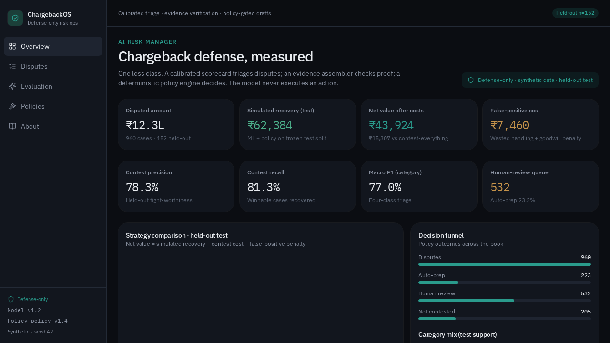
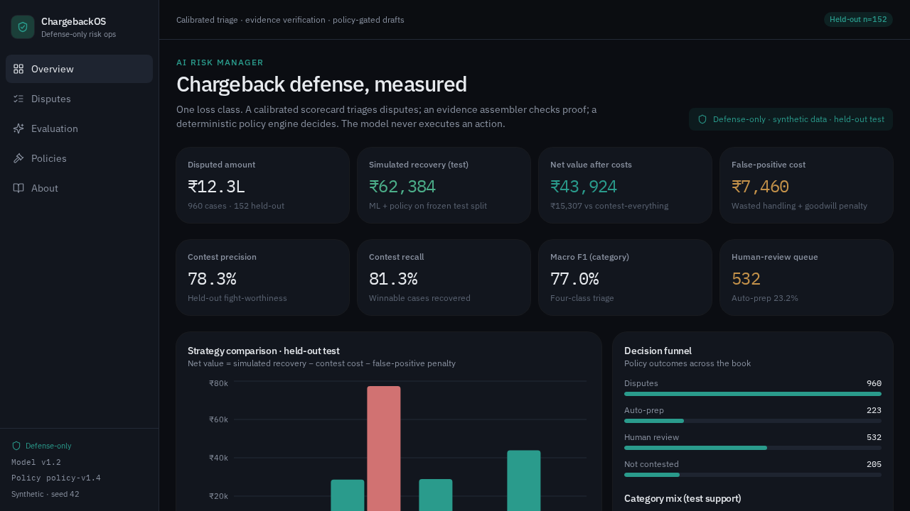
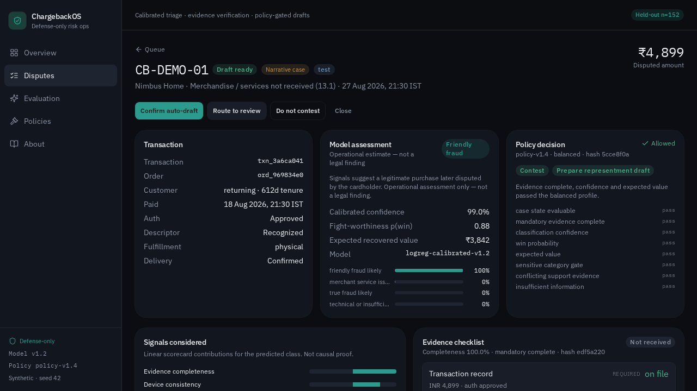
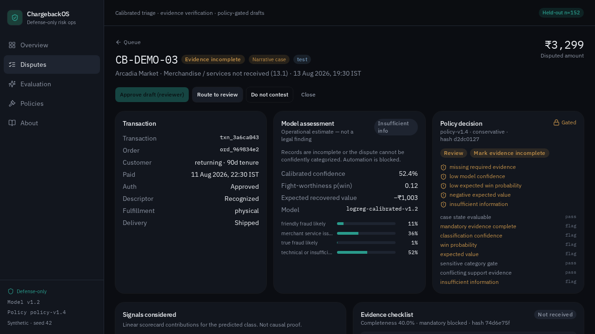
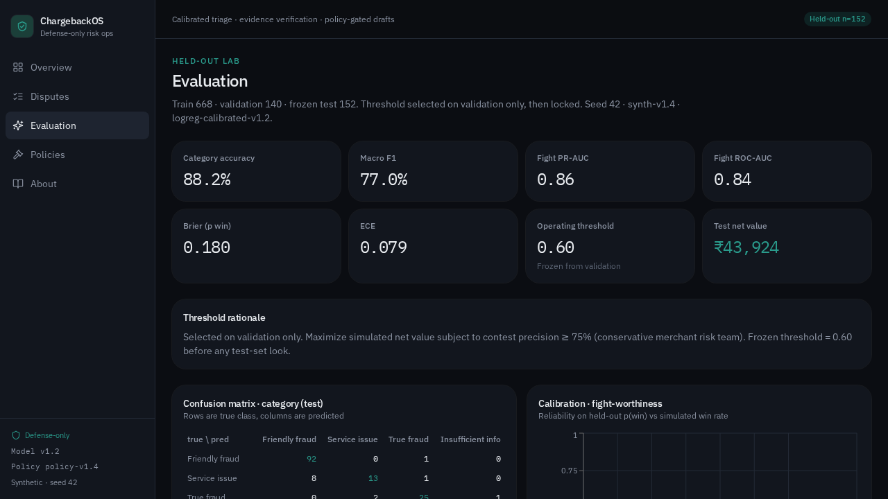
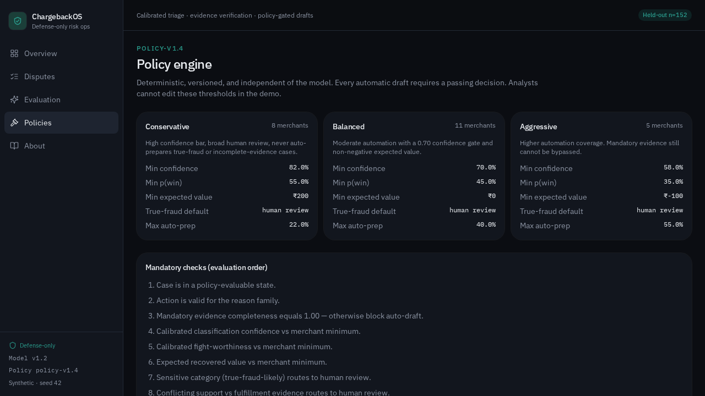
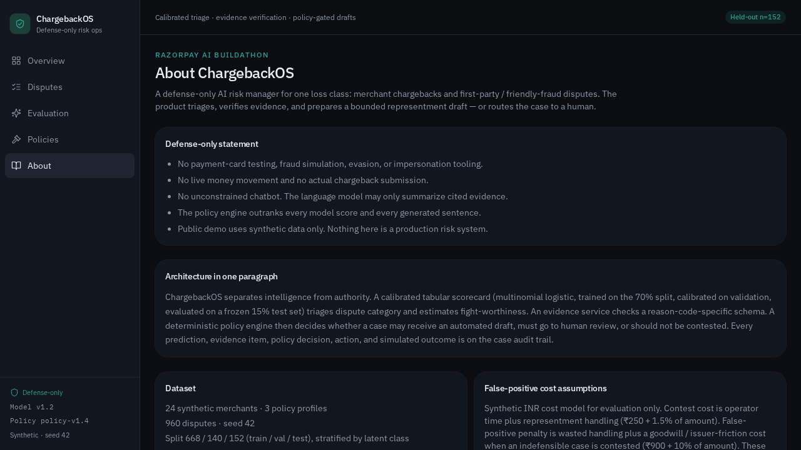

# ChargebackOS — visitor guide

This page is for **Buildathon judges**, hiring managers, and anyone opening the repo as portfolio work.

It answers, in order: what this is, what you should click, what the pictures show, what is real vs synthetic, and what is **not** finished yet.

The screenshots below are stored in `screenshots/`. They capture an earlier **dark** console. The live `DESIGN.md` is a **light** “Column” look. The story on the screens is the same: money, policy, evidence, held-out test.

---

## One paragraph

ChargebackOS is a **defense-only** staff tool for one loss class: merchant chargebacks (including friendly fraud). A calibrated scorecard *suggests*. An evidence checklist *checks proof*. A deterministic policy engine *decides*. The model cannot file anything, contact a cardholder, or move money. Data is synthetic (seed 42).

Locked stack: **TanStack Start** website (Vercel) · **FastAPI** (Render) · **Neon** Postgres. The website is not Next.js.

---

## Is this ready to submit?

**Not until it is hosted, seeded, and the scoring file survives a server restart.** The code in this folder sends the console to FastAPI after staff sign-in. That is not the same as a live URL a judge can open.

Still open:

1. Hosted URLs (Vercel + Render + Neon) and a recorded pitch are not in this folder.
2. Current Neon contents and deployed versions were not verified in the local review. A live URL must be checked separately.
3. These screenshots do not match the current light theme, and they still show an older dark console, `logreg-calibrated-v1.2`, and 960 cases. Treat them as storyboards. Live code is `hgb-calibrated-v2`, 25 merchants, 1,500 disputes, split 1,050 / 225 / 225.
4. Extra queue filters, Redis/Celery, Playwright, and 15,000 extra undisputed ledger rows are **later**, not missing by accident.

What *is* already here for a reviewer: console pages that read the operations API, policy-before-AI, held-out metrics that show **rules-only leading ML + policy on net value**, narrative cases `CB-DEMO-01` and `CB-DEMO-03`, and no leftover in-browser fake book.

---

## What to click (5 minutes)

If a live URL exists: open Render `/health/live` first (free servers sleep), then the website, then sign in as analyst.

Then:

1. **Overview** — money, four strategies, and the note that rules-only currently leads ML + policy.
2. **Disputes → CB-DEMO-01** — inspect the actual stored policy and cited evidence; the narrative label does not force model approval. Only allowed buttons are enabled.
3. **CB-DEMO-03** — policy *blocks* (missing proof). Drafting stays disabled. This is the safety beat.
4. **Evaluation** — frozen test, confusion matrix, false-positive cost. The net-value leader badge follows the numbers, not the model.
5. **Policies** — analysts cannot edit thresholds.
6. **About** — defense-only statement.

Talk track: `docs/demo_script.md`.

---

## Walkthrough with pictures

### Overview — the product in one screen



What a visitor should notice:

- One loss class, not a generic “AI fraud platform.”
- **Net value after costs** and **false-positive cost** sit next to precision/recall. Contesting is not free.
- Screenshot held-out n=152 is **historical**. Live evaluation uses n=225 on the 1,500-case book.

The companion frame with the strategy bars:



(File name is `disputes.png`; it is the overview chart state.)

### Allowed case — CB-DEMO-01



Nimbus Home, “not received,” ₹4,899. Delivery confirmed, returning customer. Policy **Allowed** in this capture. Assessment is labeled operational, not a legal finding. Live UI only enables moves the server will accept from that stage (confirm draft on draft-ready; not close). Nothing here is a live bank filing.

### Blocked case — CB-DEMO-03



Arcadia Market, missing required proof. Policy **Gated**. Completeness 40%. Auto-draft is not a hide-the-button trick: the engine lists missing evidence, low confidence, and negative expected value.

If a judge remembers one picture, it should be this one.

### Evaluation — no vibe check



Train / validation / frozen test. Threshold chosen on validation only, then locked (0.60 in this capture). Confusion matrix, calibration, Brier, ECE. Net value on the test split matches the overview (₹43,924 here).

### Policies — rules outrank the model



Conservative / balanced / aggressive. Mandatory evidence still cannot be skipped on the aggressive profile. Copy on the page: analysts cannot edit these thresholds in the demo.

### About — defense-only, in writing



No card testing, no live money, no unconstrained chatbot, synthetic data only. False-positive cost assumptions (₹250 + 1.5% contest; ₹900 + 10% FP) are documented as **assumptions**, not universal facts.

---

## How the pieces fit

```text
Synthetic dispute
    → feature snapshot (no future labels)
    → calibrated score (suggests)
    → evidence schema (required / preferred / optional)
    → policy engine (allows, reviews, or drops)
    → draft from cited evidence only, or human queue
    → audit trail
    → held-out batch vs contest-nothing / everything / rules-only
```

Intelligence and authority are separate. That is the submission thesis.

---

## Synthetic data (required, not a defect)

There are no real merchants, cards, or customers in this repo. Seed 42. See `docs/synthetic_data_disclaimer.md`.

Screenshots: 24 merchants, 960 disputes, split 668 / 140 / 152. The Python seed targets 25 merchants and ~1,500 disputes. Treat screenshot numbers as a frozen picture, not the live database.

---

## Stack (for technical visitors)

| Piece | This repo | Host |
| --- | --- | --- |
| Console | TanStack Start + `DESIGN.md` | Vercel |
| API | FastAPI in `api/` | Render |
| Data + staff login | Postgres | Neon |
| Jobs this pass | Rows in Postgres | not Redis |

Hosting: `docs/hosting.md`. Agent rules: `AGENTS.md`.

---

## Honest limits

- Not a production risk system.
- Not live representment to an issuer.
- Email/password staff login is real enough for a demo, not bank-grade identity.
- Free Render sleeps (~15 minutes idle, ~1 minute wake).
- Redis, Celery, extra queue filters, and a 15k undisputed ledger are **later**.
- Customer nagging / card retries will **not** be added. That is a different product.

---

## Where to go next in the repo

- Pitch script: `docs/demo_script.md`
- Model: `docs/model_card.md`
- Evaluation rules: `docs/evaluation_protocol.md`
- Policy: `docs/policy_engine.md`
- Threat model: `docs/threat_model.md`
- Run locally: `README.md`

The [quality review](quality_review.md) records local checks and release gates. The [current measured benchmark](../api/ml/reports/benchmark.json) uses 1,050 / 225 / 225 records and favors rules-only over ML + policy on net value. The historical screenshots are not evidence of current performance or successful hosting.
